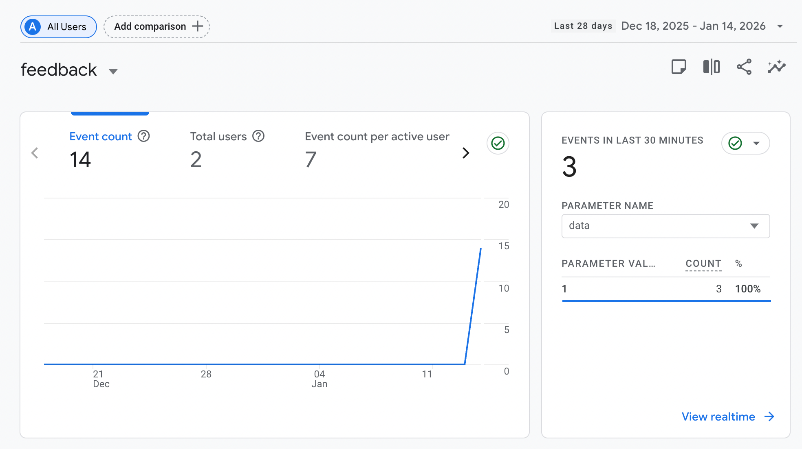

# Viewing Feedback in Google Analytics

This guide shows you how to view and analyze feedback data collected by the MkDocs Material feedback widget in Google Analytics 4.

## Overview

The MkDocs Material feedback widget (the happy/sad face icons at the bottom of each page) sends anonymous feedback data to Google Analytics. This is separate from Giscus comments and provides quantitative insights into which pages users find helpful.

## What Data Is Collected

When a user clicks a feedback icon, Material for MkDocs sends an event to Google Analytics containing:

| Data | Description |
|------|-------------|
| Page URL | Which page received feedback |
| Page Title | The title of the page |
| Rating Value | `1` for positive (happy face), `0` for negative (sad face) |

This is lightweight, anonymous feedback. No personal information is collected, and users don't need to log in.

## Accessing Google Analytics

1. Go to [analytics.google.com](https://analytics.google.com)
2. Sign in with your Google account
3. Select your property from the property selector

Your property ID is configured in `mkdocs.yml` under `extra.analytics.property` (e.g., `G-ZWKPKVQWVG`).

## Finding Feedback Events

### Step 1: Navigate to Events

1. In the left sidebar, click **Reports**
2. Expand **Engagement**
3. Click **Events**

You'll see a list of all events tracked on your site.


### Step 2: View Feedback Details

1. In the events list, find and click on **feedback**
2. This opens the detailed feedback event report



### Step 3: Analyze the Data

The feedback report shows:

- **Total feedback events** - How many times users clicked feedback icons
- **Breakdown by page** - Which pages received feedback
- **Rating distribution** - Positive vs. negative feedback counts
- **Time trends** - When feedback was submitted

## Creating Custom Reports

For deeper analysis, create custom explorations:

### Pages with Most Negative Feedback

1. Go to **Explore** in the left sidebar
2. Click **Blank** to create a new exploration
3. Add dimensions: `Page path`, `Event name`
4. Add metrics: `Event count`
5. Add a filter: `Event name` equals `feedback`
6. Sort by event count descending

This helps identify content that needs improvement.

### Feedback Trends Over Time

1. Create a new exploration
2. Add dimension: `Date`
3. Add metrics: `Event count`
4. Filter by `Event name` equals `feedback`
5. Use a line chart visualization

This shows if your content improvements are having an impact.

### Positive vs. Negative by Section

1. Create a new exploration
2. Add dimensions: `Page path`, `Event parameter` (data value)
3. Add metrics: `Event count`
4. Filter by `Event name` equals `feedback`
5. Create a pivot table grouped by page path

This compares how different sections perform.

## Understanding the Metrics

### Rating Values

| Value | Meaning | Icon |
|-------|---------|------|
| `1` | Positive - Page was helpful | Happy face |
| `0` | Negative - Page could be improved | Sad face |

### Key Questions to Answer

- **Which pages have the most negative feedback?** These need attention first.
- **What's the overall positive/negative ratio?** Aim for 80%+ positive.
- **Are trends improving over time?** Track the impact of content changes.
- **Which chapters perform best?** Learn from what works.

## Feedback Widget vs. Giscus Comments

The feedback widget and Giscus comments serve complementary purposes:

| Feature | Feedback Widget | Giscus Comments |
|---------|-----------------|-----------------|
| **Data Storage** | Google Analytics | GitHub Discussions |
| **User Effort** | One click | Write a comment |
| **Authentication** | None required | GitHub login |
| **Detail Level** | Binary (good/bad) | Full text comments |
| **Response Time** | Instant | Requires reading |
| **Best For** | Quick sentiment | Detailed feedback |

### How They Work Together

In this template, both systems are integrated:

1. **User sees feedback icons** at the bottom of the page
2. **User clicks an icon** (positive or negative)
3. **Rating is sent to Google Analytics** for aggregate tracking
4. **Giscus comment form appears** inviting detailed feedback
5. **User can optionally write a comment** stored in GitHub Discussions

This two-step approach captures both:

- **Quantitative data** - How many people found each page helpful (Analytics)
- **Qualitative data** - Why they felt that way (Discussions)

## Configuration Reference

The feedback widget is configured in `mkdocs.yml`:

```yaml
extra:
  analytics:
    provider: google
    property: G-XXXXXXXXXX  # Your GA4 property ID
    feedback:
      title: Was this page helpful?
      ratings:
        - icon: material/emoticon-happy-outline
          name: This page was helpful
          data: 1
          note: >-
            Thanks for your feedback!
        - icon: material/emoticon-sad-outline
          name: This page could be improved
          data: 0
          note: >-
            Thanks for your feedback!
```

### Configuration Options

| Option | Description |
|--------|-------------|
| `provider` | Analytics provider (`google` for Google Analytics) |
| `property` | Your Google Analytics 4 measurement ID (starts with `G-`) |
| `feedback.title` | The question displayed above the icons |
| `ratings` | Array of feedback options (typically 2 choices) |
| `ratings[].icon` | Material icon name |
| `ratings[].name` | Tooltip text shown on hover |
| `ratings[].data` | Numeric value sent to Google Analytics |
| `ratings[].note` | Message displayed after user clicks |

## Troubleshooting

### No Feedback Events Appearing

1. **Check property ID** - Verify `G-XXXXXXXXXX` in mkdocs.yml matches your GA4 property
2. **Wait for processing** - GA4 can take up to 24 hours to show new events
3. **Check Realtime** - Go to Reports → Realtime to see live events
4. **Verify deployment** - Feedback only works on deployed sites, not localhost

### Events Show But No Feedback

1. Ensure `feedback` section exists under `analytics` in mkdocs.yml
2. Check that both rating options are configured
3. Verify the site has been redeployed after configuration changes

### Can't Find Your Property

1. Verify you're signed into the correct Google account
2. Check if you have access permissions to the property
3. Confirm the property ID exists in your GA4 account

## Best Practices

1. **Review weekly** - Check feedback trends at least once a week
2. **Act on negative feedback** - Prioritize pages with high negative ratings
3. **Track improvements** - Note when you update content and watch for rating changes
4. **Combine with comments** - Read Giscus comments for context on negative ratings
5. **Set up alerts** - Configure GA4 to notify you of unusual feedback patterns

## Related Documentation

- [Tutorial Introduction](index.md) - Overview of feedback systems
- [Getting Started](getting-started.md) - Initial setup guide
- [MkDocs Material Analytics](https://squidfunk.github.io/mkdocs-material/setup/setting-up-site-analytics/) - Official documentation
